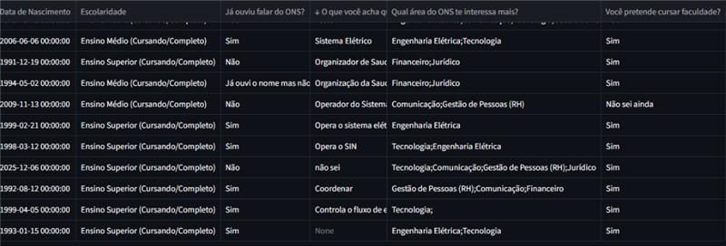
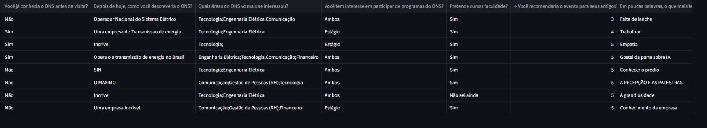
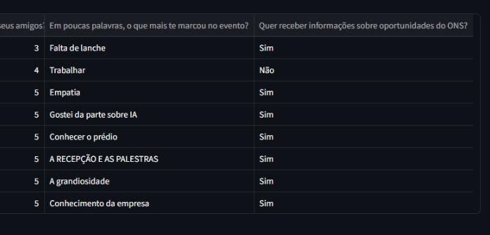

# Dashboard para análise de banco de talentos

Formulario 1:

Formulario 2:

# Contexto

Impactos para o ONS

O ONS Inspira traz benefícios diretos para a empresa, com três metas principais.

Primeiro, aumentar a visibilidade do ONS e das nossas carreiras.
Ao apresentar a empresa para jovens, mostramos o papel do ONS na sociedade e quebramos o estigma de que aqui só trabalham pessoas da área de energia. 
Mostramos que existem várias oportunidades em diferentes áreas.

Segundo, informar os jovens sobre o programa de Jovem Aprendiz.
Durante o evento, explicamos o processo seletivo e toda a documentação necessária. 
Isso ajuda a reduzir o tempo de espera dos candidatos e agiliza o processo de contratação.

E terceiro, criar um banco de talentos direcionado.
Durante o evento, aplicamos duas pesquisas: uma no início, para conhecer melhor os jovens, seus interesses, áreas preferidas e conhecimento sobre o ONS e outra no final, com feedbacks e novas informações.
Com esses dados, construiremos um painel de indicadores que mostra o impacto do projeto e ajuda a identificar jovens interessados em seguir carreira no ONS.

# Proximos Passos ONS inspira

## Análise de Maquina

Analisando os dados dos formulários, percebo um conjunto de informações bastante...  **intrigante** !

No  **Formulário 1 (Conhecendo Você)**  tenha uma visão sobre os talentos, suas escolaridades e as áreas de interesse no ONS, como 'Tecnologia' e 'Engenharia Elétrica' surgindo com frequência. 

Já o  **Formulário 2 (Evento Foi um Prazer)** As descrições do ONS são entusiasmadas e a alta taxa de recomendação é um excelente indicador de sucesso. O interesse em 'Estágio' e 'Ambos' (programas) é promissor para futuras oportunidades. As áreas de interesse se alinham bem com o Formulário 1, reforçando a demanda por Tecnologia e Engenharia.

## Sistema de recomendação em Python e Streamlit
